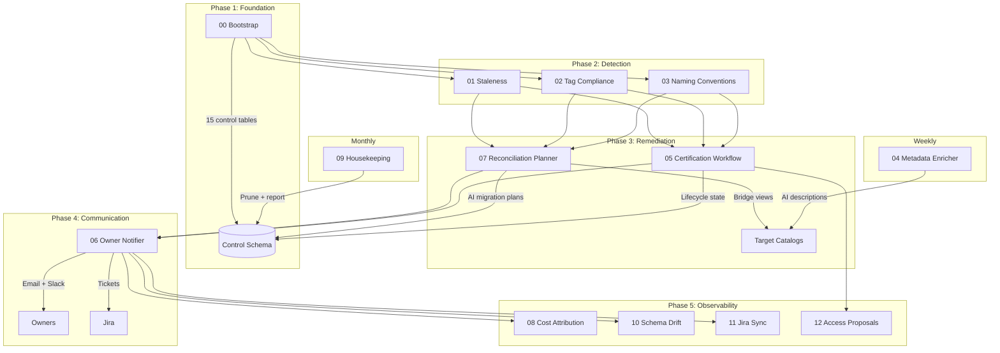

# UC Steward

> *Clean Up, Aisle Five.*

Catalog cleanup doesn't happen because breaking a dashboard is a career risk. Nobody renames a table — even one named `tmp_backup_v3_FINAL` — when five downstream consumers might silently break. **UC Steward removes the fear.** It builds the bridge view *before* it moves anything, so consumers keep working while the estate gets cleaned.

Observability tools report violations. UC Steward resolves them.

---

## Why This Exists Now

Your Unity Catalog is about to become the ontology layer for AI agents. Every untagged `_bak` table, every orphaned staging artifact, every table with no domain assignment is **ontology pollution** — and agents inherit it. When a Genie space or tool-calling agent queries your catalog, dead tables don't just waste storage. They reduce retrieval precision, inject hallucination risk, and set a ceiling on agent accuracy that no prompt engineering can fix.

Governance isn't hygiene anymore. It's the difference between agents that work and agents that confidently cite a three-year-old backup table.

---

## What Makes It Different

UC Steward isn't a scanner that dumps a spreadsheet of problems. It's a **lineage-aware remediation engine** built around one key insight: the bridge view is the unit of safe change.

When it finds a violation, it:

1. Queries UC lineage to map every upstream and downstream dependency
2. Generates a risk-scored migration plan (AI-powered, with rollback steps)
3. **Creates a backward-compatible bridge view** so consumers never break
4. Opens a Jira ticket, notifies the owner, and tracks to completion
5. Computes the annualized cost of inaction (storage + compute waste)

The result isn't a report. It's a pull request for your data catalog.

### Certification Readiness Score

UC Steward scores your estate not against arbitrary rules, but against **how much of it is ready to be trusted by Discover and by agents**:

| Dimension | Weight | What It Measures |
|-----------|--------|-----------------|
| Tag coverage | 30% | Can an agent find this table by domain and purpose? |
| Certification state | 30% | Has a steward vouched for this table's quality? |
| Feature enablement | 30% | Are platform safeguards (monitoring, classification) active? |
| Violation backlog | 10% | How much unresolved risk is accumulating? |

The score answers one question: *what percentage of my catalog is agent-ready?*

## Quickstart

```bash
# Clone and configure
git clone https://github.com/kevin-ippen/uc-steward.git
cd uc-steward

# Edit databricks.yml — set your catalog and target
# Then deploy in dry-run mode (read-only, no writes)
databricks bundle deploy --target dev

# NOT safe by default — set dry_run: "true" in databricks.yml first
# Then run the daily governance job to preview what it would do
databricks bundle run uc_steward_daily_governance --target dev
```

> **First run?** Set `dry_run: "true"` in your target variables. UC Steward will scan, detect, and generate plans — but won't create Jira tickets, send notifications, or write bridge views until you're ready.

---

## Architecture



---

## What It Does

### Three Jobs, Full Lifecycle

| Job | Schedule | Purpose |
|-----|----------|---------|
| **Daily Governance** | 06:00 ET | Detect → Plan → Notify → Track |
| **Weekly Enrichment** | Sun 03:00 ET | AI-generate missing descriptions and PII tags |
| **Monthly Housekeeping** | 1st 04:00 ET | Prune old records, expire certs, health report |

### Detection Capabilities

| Scanner | What It Finds |
|---------|--------------|
| Staleness Detector | Tables not accessed in N days (configurable) |
| Tag Compliance | Missing required tags (owner, domain, quality_tier) |
| Naming Enforcer | Tables/schemas violating naming patterns |
| Schema Drift | Column additions, removals, type changes since last scan |
| Feature Checks | Platform features not enabled (predictive optimization, classification, monitoring) |

### Remediation Actions

| Action | Description |
|--------|------------|
| Migration Plan | AI-generated rename + migration steps with rollback plan |
| Bridge View | Backward-compatible view at old name pointing to new location |
| Access Proposals | GRANT/REVOKE recommendations based on certification state |
| Jira Tickets | Auto-created with priority, linked to plan |
| Owner Notifications | Email + Slack with actionable next steps |

---

## Control Tables (15)

All tables live in your configured control schema (default: `uc_hygiene`):

| Table | Purpose |
|-------|---------|
| `scan_results` | Daily scan findings with severity and recommended actions |
| `certification_state` | Certification lifecycle per table (certified → overdue → deprecated) |
| `migration_plans` | AI-generated remediation plans with status tracking |
| `bridge_views` | Registry of backward-compat views with expiration |
| `notification_log` | All owner notifications with response tracking |
| `cost_attribution_daily` | Workload cost attribution by SKU and asset |
| `asset_inventory_snapshot` | Point-in-time table inventory for trend analysis |
| `job_run_history` | Execution history for all UC Steward tasks |
| `exemptions` | Pattern-based scan exclusions (regex on catalog/schema/table) |
| `governance_policy` | Canonical governance rules (seeded from `policies/policy.yml`) |
| `feature_check_results` | Platform feature enablement check results |
| `external_tool_registry` | External BI/ETL tools invisible to UC lineage |
| `schema_drift_events` | Column-level schema changes with severity |
| `schema_column_baseline` | Baseline for drift comparison |
| `cross_workspace_rollup` | Multi-workspace governance metrics |

---

## Safety Model

### Dry Run Mode

Set `dry_run: "true"` in your target variables. In dry-run mode:
- All scans and detection runs normally
- Migration plans are generated and stored
- **No** Jira tickets are created
- **No** email/Slack notifications are sent
- **No** bridge views are written to target catalogs
- The governance score still computes

### Idempotency

- All writes use `MERGE INTO` (upsert semantics) — safe to re-run
- Migration plans are keyed on (catalog, schema, table, violation_type) — no duplicates
- Bridge views use `CREATE OR REPLACE VIEW` — always current
- Schema drift compares against a baseline that updates after each scan — re-runs produce no false positives

### Exemptions

Tables can be excluded from scanning via the `exemptions` table:

```sql
INSERT INTO {control_schema}.exemptions VALUES (
  uuid(), 'table', 'catalog.schema.quarterly_regulatory_*',
  'Quarterly reporting tables - exempt from staleness',
  '2026-12-31', current_user(), current_timestamp(), true
);
```

Pattern types: `table` (full FQN glob), `schema` (schema-level), `catalog` (entire catalog).

### What It Cannot See

- Notebooks that haven't run recently (outside lineage retention window)
- String-interpolated table references (`f"SELECT * FROM {tbl}"`)
- External BI tools connecting via JDBC/ODBC (register in `external_tool_registry`)
- Cross-workspace references (lineage is workspace-scoped)

**Mitigation:** Extended bridge view TTLs (30–90 days) give most consumers time to surface. Register external tools in the registry so the planner factors them into risk.

---

## Required Permissions

The service principal running UC Steward needs:

| Permission | Scope | Why |
|-----------|-------|-----|
| `USE CATALOG` | Target catalogs | List schemas and tables |
| `USE SCHEMA` | Target schemas | Describe tables, read tags |
| `SELECT` | `system.access.audit` | Staleness detection (last access time) |
| `SELECT` | `system.billing.usage` | Cost attribution |
| `SELECT` | `system.query.history` | Query-based lineage supplement |
| `SET TAGS` | Target tables | Tag compliance remediation (optional) |
| `CREATE VIEW` | Target schemas | Bridge view creation (optional) |
| `MANAGE` | Control schema | Full CRUD on control tables |

> **Minimal read-only mode:** With only `USE CATALOG` + `USE SCHEMA` + system table `SELECT`, UC Steward runs all detection and generates plans — it just can't execute remediation. This is the recommended starting posture.

---

## Configuration Reference

All configuration is via bundle variables in `databricks.yml`. Override per-target:

<details>
<summary>Full variable reference (click to expand)</summary>

| Variable | Default | Description |
|----------|---------|-------------|
| `catalog` | `""` | Unity Catalog catalog for control tables |
| `control_schema` | `uc_hygiene` | Schema name for control tables |
| `target_catalogs` | `""` | Comma-separated catalogs to scan |
| `staleness_days` | `30` | Days without access before flagging |
| `table_name_pattern` | `^[a-z][a-z0-9_]*$` | Regex for valid table names |
| `schema_name_pattern` | `^[a-z][a-z0-9_]*$` | Regex for valid schema names |
| `required_table_tags` | `owner,domain,quality_tier` | Tags every table must have |
| `notification_email` | `""` | Fallback email for unowned assets |
| `slack_webhook_url` | `""` | Slack webhook for notifications |
| `jira_base_url` | `""` | Jira URL (empty = disabled) |
| `jira_project_key` | `""` | Jira project for ticket creation |
| `dry_run` | `false` | Suppress all write actions |
| `feature_check_mode` | `standard` | `standard` or `elevated` (admin) |
| `enable_feature_checks` | `true` | Enable platform feature checks |
| `model_name` | `databricks-claude-haiku-4-5` | LLM for AI-generated plans (any FMAPI-compatible endpoint) |
| `enable_ai_plans` | `true` | Enable AI migration plan generation |

</details>

---

## Governance Score

UC Steward computes a composite governance score (0–100) from four dimensions:

| Dimension | Weight | Source |
|-----------|--------|--------|
| Tag coverage | 30% | % of tables with owner + domain + quality tags |
| Certification | 30% | % of tables in certified state |
| Feature enablement | 30% | % of platform features passing checks |
| Violation backlog | 10% | Penalty per open critical/warning finding |

The score trends over time in `cross_workspace_rollup` and is available via `src/lib/governance_score.py` for dashboard integration.

---

## SQL Alerts (Real-Time Monitoring)

Six pre-built alert queries in `src/lib/alerts.py`:

1. **Critical Violations >7d** — Unresolved critical findings (every 60m)
2. **Certification Expiry** — Tables due for review in 14 days (daily)
3. **Feature Check Failures** — Platform features not enabled (daily)
4. **Schema Drift Critical** — Column removals or type changes (daily)
5. **Stale Notifications** — Owner notifications pending >30d (daily)
6. **Job Failures** — UC Steward task failures (every 60m)

---

## Project Structure

```
uc-steward/
├── databricks.yml              # Bundle configuration + variables
├── resources/
│   ├── jobs.yml                # 3 jobs, 12 tasks
│   ├── schemas.yml             # Control schema resource
│   └── alerts.yml              # Alert documentation
├── src/
│   ├── 00_control_plane_bootstrap.py
│   ├── 01_staleness_detector.ipynb
│   ├── 02_tag_compliance_scanner.ipynb
│   ├── 03_naming_convention_enforcer.ipynb
│   ├── 04_metadata_enricher.ipynb
│   ├── 05_certification_workflow.ipynb
│   ├── 06_owner_notifier.ipynb
│   ├── 07_reconciliation_planner.ipynb
│   ├── 08_cost_attribution_tracker.py
│   ├── 09_monthly_housekeeping.py
│   ├── 10_schema_drift_detector.ipynb
│   ├── 11_jira_sync.ipynb
│   ├── 12_access_proposals.ipynb
│   └── lib/                    # Shared Python modules
│       ├── common.py           # Validation, safe SQL, exemptions
│       ├── policy.py           # Policy accessors
│       ├── feature_checks.py   # Platform feature probes
│       ├── schema_drift.py     # Drift detection engine
│       ├── jira_sync.py        # Bi-directional Jira sync
│       ├── access_proposals.py # GRANT/REVOKE proposal engine
│       ├── alerts.py           # SQL alert definitions
│       ├── governance_score.py # Composite score + dashboards
│       └── tests/              # 62 pytest tests
├── policies/
│   └── policy.yml              # Governance rules source-of-truth
├── dashboards/
│   └── UC Steward — Feature Enablement Score.lvdash.json
├── examples/                   # Sample output for evaluation
├── docs/                       # Extended documentation
├── LICENSE                     # Apache 2.0
└── CONTRIBUTING.md
```

---

## Roadmap

- [ ] Interactive Slack bot for approve/reject of migration plans
- [ ] Certification approval workflow via Genie Space
- [ ] Sample bridge view DDL + Jira ticket screenshot in `examples/`

---

## Contributing

See [CONTRIBUTING.md](CONTRIBUTING.md) for guidelines.

---

## License

Apache 2.0 — see [LICENSE](LICENSE).
